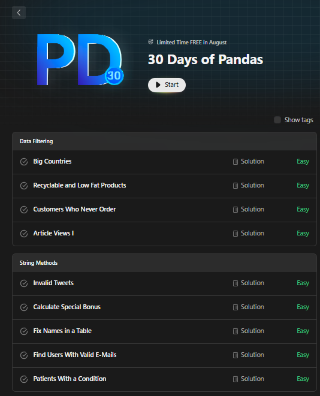

# Collection of Questions and Answers from the 30-Day Pandas Challenge

  

Welcome to the "Collection of Questions and Answers from the 30-Day Pandas Challenge"! This repository contains a comprehensive set of questions and corresponding answers from the 30-Day Pandas Challenge, designed to help individuals enhance their proficiency in using the Pandas library for data manipulation and analysis.

## Overview

The "Collection of Questions and Answers from the 30-Day Pandas Challenge" serves as a valuable resource for individuals seeking to strengthen their skills in working with data using the Pandas library. The challenge consists of a series of tasks and exercises that cover a wide range of Pandas functionalities, from data loading and cleaning to advanced data manipulation techniques.

In addition, this repository also includes SQL solutions for some of the challenges. These SQL solutions provide an alternative perspective on solving the same data manipulation problems using SQL queries.

